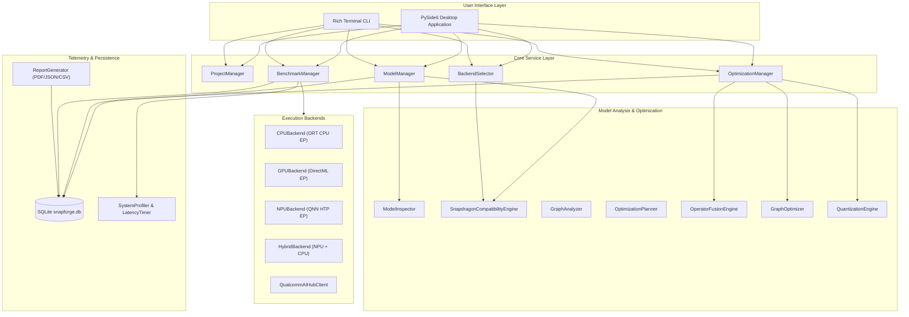

# SnapForge Architecture Specification

## 1. System Overview

SnapForge is designed as a **modular, offline-first engineering workstation application** for analyzing, optimizing, and deploying AI models to Qualcomm Snapdragon X-series platforms.

The architecture strictly separates concerns into decoupled layers:
1. **User Interface Layer**: PySide6 desktop GUI and Rich terminal CLI.
2. **Core Service Layer**: Project management, model registry, optimization orchestration, differential benchmarking, and automated backend routing.
3. **Model & Graph Layer**: Deep ONNX inspection, FLOPs estimation, topological dependency traversal, and Snapdragon capability evaluation.
4. **Optimization Engines**: Operator fusion, constant folding, dead code elimination, and FP16 / INT8 quantization.
5. **Hardware & Execution Target Layer**: Abstract `BaseBackend` with CPU, GPU (DirectML), NPU (Qualcomm QNN HTP), Hybrid, and Qualcomm AI Hub cloud drivers.
6. **Telemetry & Profiling**: Monotonic latency timers, percentile calculation, process RSS memory monitoring, and CPU/NPU hardware telemetry.
7. **Storage & Reporting**: SQLite persistence and ReportLab PDF, JSON, and CSV export engines.



---

## 2. Key Architectural Components

### 2.1 Model Inspection & Graph Analysis (`app/models/`)
* **`ModelInspector`**:
  - Ingests ONNX graphs and PyTorch modules.
  - Traverses the computational graph and initializers to extract tensor dimensions, element types, parameter counts, and opset versions.
  - Calculates estimated FLOPs for computationally intensive nodes (`Conv`, `ConvTranspose`, `Gemm`, `MatMul`, `Pooling`).
* **`SnapdragonCompatibilityEngine`**:
  - Maintains a capability registry mapping ONNX operators to Qualcomm Hexagon Tensor Processor (HTP / DSP) support levels: `SUPPORTED`, `PARTIAL`, `UNSUPPORTED`, `UNKNOWN`.
  - Calculates the **Unweighted Operator Count Score**:
    $$\text{Score}_{\text{count}} = \frac{N_{\text{supported}}}{N_{\text{total}}} \times 100$$
  - Calculates the **Compute-Weighted Compatibility Score**:
    $$\text{Score}_{\text{compute}} = \frac{\sum \text{FLOPs}_{\text{supported}} + 0.5 \sum \text{FLOPs}_{\text{partial}}}{\sum \text{FLOPs}_{\text{all}}} \times 100$$
  - Detects architectural bottlenecks (e.g. `NonMaxSuppression`, dynamic control flow, unquantized custom operators).
* **`GraphAnalyzer`**:
  - Partitions models into consecutive NPU and CPU subgraphs for hybrid execution.
  - Computes boundary transitions and intermediate tensor volumes.

---

### 2.2 Optimization Engines (`app/optimization/`)
* **`OperatorFusionEngine`**:
  - Safely folds `BatchNormalization` into preceding `Conv` weights and biases:
    $$W_{\text{new}} = W \cdot \frac{\gamma}{\sqrt{\sigma^2 + \epsilon}}$$
    $$B_{\text{new}} = (B - \mu) \cdot \frac{\gamma}{\sqrt{\sigma^2 + \epsilon}} + \beta$$
  - Reroutes tensor consumers and eliminates the BatchNorm operator entirely from the graph.
* **`GraphOptimizer`**:
  - Eliminates orphaned dead nodes not contributing to graph outputs.
  - Removes redundant `Identity` and `Cast` operators.
  - Applies Level 1 ONNX Runtime basic optimizations (constant expression evaluation).
* **`QuantizationEngine`**:
  - FP16 IEEE 754 half-precision conversion.
  - Dynamic INT8 quantization (`QInt8` / `QUInt8`) targeting matrix operations (`MatMul`, `Gemm`, `Conv`, `Attention`).
  - Static INT8 (QDQ) quantization with synthetic or user-supplied calibration data readers.

---

### 2.3 Execution Backend Layer (`app/backends/`)
SnapForge isolates all execution behind the abstract `BaseBackend` interface:
```python
class BaseBackend(ABC):
    def get_device_info(self) -> Dict[str, Any]: ...
    def get_capabilities(self) -> Dict[str, Any]: ...
    def is_available(self) -> bool: ...
    def validate_model(self, model_path) -> Tuple[bool, str]: ...
    def load_model(self, model_path, options=None) -> Any: ...
    def run_inference(self, input_feed) -> Dict[str, np.ndarray]: ...
    def benchmark(self, model_path, warmup_runs, measured_runs) -> Dict[str, Any]: ...
```

#### Backends:
1. **`CPUBackend`**:
   - Uses ONNX Runtime `CPUExecutionProvider`.
   - Multi-threaded intra-op and inter-op thread pool configuration.
2. **`GPUBackend`**:
   - Uses Windows DirectML (`DmlExecutionProvider`) for Qualcomm Adreno and host GPUs.
3. **`NPUBackend`**:
   - Targets Qualcomm Hexagon HTP via `QNNExecutionProvider`.
   - Configures HTP burst performance mode, graph optimization mode 3, and VTCM sizing.
   - If Hexagon NPU is absent on the host environment, reports `[Unavailable]` with genuine diagnostic status.
4. **`HybridBackend`**:
   - Executes the NPU-supported feature backbone on NPU (or simulated NPU) while routing unsupported post-processing layers to the CPU fallback partition.

---

### 2.4 Empirical Benchmarking & Profiling (`app/profiling/`)
* **`LatencyTimer`**:
  - Uses 64-bit monotonic clock (`time.perf_counter_ns`) for nanosecond resolution.
  - Calculates non-parametric percentiles (Median, P90, P95, P99), standard deviation, and throughput in FPS.
* **`MemoryTracker`**:
  - Queries OS process virtual and resident memory (RSS) using `psutil`.
* **`AccuracyValidator`**:
  - Computes numerical similarity between original FP32 outputs and optimized INT8/FP16 outputs using Cosine Similarity, Mean Absolute Error (MAE), Root Mean Squared Error (RMSE), and Maximum Absolute Difference.
