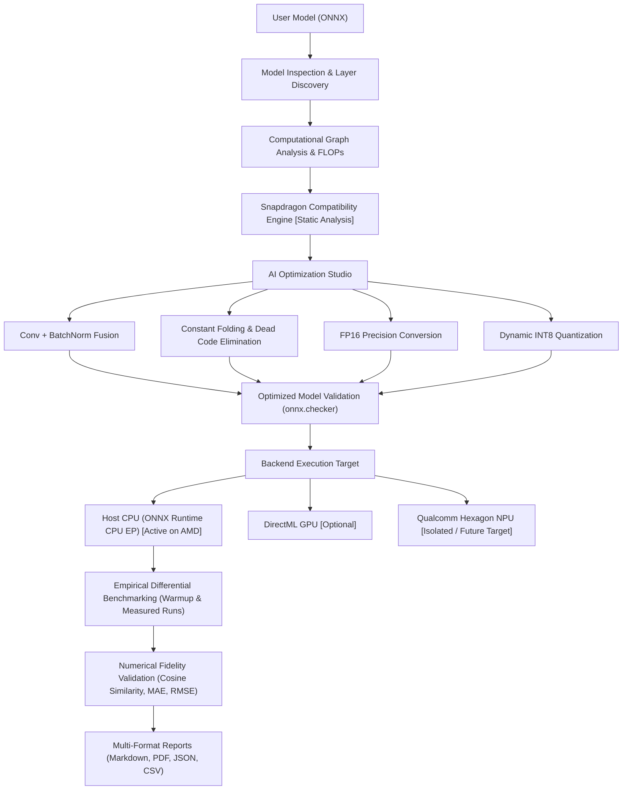

# Nibble — Snapdragon AI Optimization Studio

[](https://www.python.org/)
[](https://microsoft.com/windows)
[](https://amd.com)
[](https://qualcomm.com)
[](https://qt.io)
[](./scripts/test_mvp.py)

**Nibble** is a production-quality AI model optimization and deployment platform specifically designed for **HP PCs powered by Qualcomm Snapdragon processors** (Snapdragon X Elite, Snapdragon X Plus, and compatible Snapdragon platforms).

Nibble analyzes computational graphs, evaluates operator compatibility with the Qualcomm Hexagon NPU, Adreno GPU, and CPU, applies mathematically verified optimizations (operator fusion, dead code elimination, constant folding, and precision conversion), benchmarks models empirically with monotonic hardware timers, and produces detailed multi-format optimization reports.

---

## 1. Important Hardware Rule & Development Status

Nibble is being actively developed on an **AMD Windows laptop** (`AMD Ryzen 5 8540U w/ Radeon 740M Graphics`, architecture `AMD64`).

> [!IMPORTANT]
> **Strict Hardware Separation Rule:**
> - AMD hardware is NEVER misrepresented as Qualcomm Snapdragon.
> - The Qualcomm Hexagon NPU backend is strictly isolated and clearly marked **`[Unavailable on this hardware]`** on AMD systems.
> - All latency, memory, and throughput metrics are **empirically measured** on host hardware and clearly tagged **`[Measured]`**.
> - Benchmark numbers and speedups are NEVER fabricated.

```text
Development Hardware Status:
  Vendor: AMD
  Architecture: x64/AMD64
  Snapdragon NPU: Not detected (Unavailable on this hardware)
  Qualcomm QNN: Not active
```

### Supported Capabilities Matrix

| Feature | Supported Now on AMD Development PC | Supported Later on Snapdragon PC |
| :--- | :--- | :--- |
| **Model Ingestion & Inspection** | Yes (ONNX Opset 11–21) | Yes (ONNX & PyTorch) |
| **Graph Topology & FLOPs Analysis** | Yes (Full graph traversal) | Yes (Full graph traversal) |
| **Snapdragon Compatibility Engine** | Yes (Static Hexagon/Adreno analysis) | Yes (Static & dynamic profile) |
| **Conv + BatchNorm Operator Fusion**| Yes (Weight folding) | Yes (Weight folding) |
| **Graph Optimization** | Yes (Constant folding, dead code) | Yes (Constant folding, dead code) |
| **FP16 Precision Conversion** | Yes (IEEE float16 weights & ops) | Yes (Hexagon FP16 HTP acceleration) |
| **Dynamic INT8 Quantization** | Yes (CPU dynamic quant via ORT) | Yes (Host CPU execution) |
| **Snapdragon HTP INT8 (QDQ)** | Future Target (Static plan generated) | Native (HTP compilation & DLC) |
| **Inference Execution** | Yes (Host CPU multi-threaded) | Native (Qualcomm Hexagon NPU via QNN) |
| **GPU Acceleration** | Optional (DirectML if ORT DML installed) | Native (Adreno GPU via DirectML) |
| **Empirical Benchmarking** | Yes (Real monotonic timer measurements) | Yes (Real on-device NPU measurements) |
| **Accuracy Validation** | Yes (Cosine similarity, MAE, RMSE) | Yes (Cosine similarity, MAE, RMSE) |
| **Reporting (MD, PDF, JSON, CSV)** | Yes (With AMD development disclaimer)| Yes (With Snapdragon native badge) |
| **Qualcomm AI Hub Cloud Validation** | Yes (Optional via official `qai-hub` SDK) | Yes (Optional via official `qai-hub` SDK) |

---

## 2. Complete End-to-End Pipeline



---

## 3. Installation & Virtual Environment Setup

### Prerequisites
* Windows 11 (AMD, Intel, or Qualcomm ARM64 PC)
* Python 3.11+
* Git

### Step-by-Step Setup

```powershell
# 1. Clone the repository
git clone https://github.com/your-username/nibble.git
cd nibble

# 2. Create and activate a clean virtual environment
py -3.11 -m venv .venv
.venv\Scripts\activate

# 3. Upgrade pip
python -m pip install --upgrade pip

# 4. Install lean runtime dependencies for AMD PC
pip install -r requirements.txt
```

### Dependency Files Structure
* **`requirements.txt`**: Lean core runtime (`numpy`, `onnx`, `onnxruntime`, `psutil`, `pydantic`, `PySide6`, `matplotlib`, `pandas`, `SQLAlchemy`, `reportlab`, `rich`, `click`, `requests`).
* **`requirements-dev.txt`**: Development and test suite tools (`pytest`, `black`, `flake8`).
* **`requirements-snapdragon.txt`**: Packages required exclusively on Qualcomm Snapdragon ARM64 devices (`onnxruntime-qnn`, `qai-hub`).

---

## 4. Test Model Generator

Generate a reproducible, verified ONNX test CNN containing standard layers (`Conv -> Relu -> Conv -> Relu -> GlobalAveragePool -> Flatten -> Gemm`):

```powershell
python scripts/create_test_model.py
```

Output:
```text
[OK] Generated and verified test model: E:\snapdragon\models\test_cnn.onnx (22,445 bytes)
```

---

## 5. Automated 15-Stage MVP Validation

Run the single automated end-to-end verification script:

```powershell
python scripts/test_mvp.py
```

This verifies the complete 15-step pipeline without mock data:
1. Python Environment Check
2. Hardware Detection Check (confirms AMD detected, confirms Snapdragon false)
3. Test Model Generation (`models/test_cnn.onnx`)
4. Model Structural Validation (`onnx.checker.check_model`)
5. Model Architecture Inspection (parameters, layers, inputs/outputs)
6. Computational Graph Analysis (nodes, edges, partitions)
7. Snapdragon Compatibility Analysis [Static Analysis]
8. Model Optimization (Fusion & FP16 Conversion)
9. Output Model Validation (`onnx.checker.check_model`)
10. Original Model CPU Inference
11. Optimized Model CPU Inference
12. Empirical Benchmarking (10 warmup, 50 measured runs on host CPU)
13. Accuracy Validation (MAE, RMSE, Cosine Similarity)
14. Qualcomm Backend Refusal & Isolation Test (`SnapdragonExecutionUnavailableError`)
15. Report Generation (`.md`, `.json`, `.csv`, `.pdf` with AMD notice & disclaimer)

Expected Final Output:
```text
============================================================
    NIBBLE MVP VALIDATION: PASSED
============================================================
```

---

## 6. Command-Line Interface (CLI)

Nibble provides a unified CLI module executable directly with `python -m nibble`:

### 1. Hardware Inspection
Display genuine host hardware specifications and Qualcomm toolchain readiness:
```powershell
python -m nibble hardware
```

### 2. Model Analysis
Inspect layer architecture, parameter count, and compute Snapdragon compatibility:
```powershell
python -m nibble analyze models/test_cnn.onnx
```

### 3. Model Optimization
Apply operator fusion, graph optimization, and precision conversion (FP16 or INT8):
```powershell
python -m nibble optimize models/test_cnn.onnx --precision FP16
```

### 4. Empirical Benchmarking
Execute warmup and measured runs on CPU with high-resolution latency percentiles and throughput:
```powershell
python -m nibble benchmark models/test_cnn.onnx --warmup 10 --runs 50
```

### 5. Automated MVP Validation
Run the full verification suite via CLI:
```powershell
python -m nibble test-mvp
```

### 6. Qualcomm AI Hub Cloud Validation & Device Profiling
Manage and profile models on physical Snapdragon cloud hardware:
```powershell
# Check AI Hub SDK readiness and account status
python -m nibble aihub status

# Configure your Qualcomm AI Hub API token
python -m nibble aihub configure --token YOUR_API_TOKEN

# List available physical Snapdragon devices
python -m nibble aihub devices --filter "X Elite"

# Upload and profile on genuine Snapdragon Hexagon NPU
python -m nibble aihub profile models/test_cnn.onnx --device "Snapdragon X Elite CRD"

# Compare host AMD execution vs remote Snapdragon NPU
python -m nibble compare-local-aihub models/test_cnn.onnx
```

### 7. Desktop GUI
Launch the modern PySide6 desktop interface:
```powershell
python -m nibble gui
# or: python run.py
```

---

## 7. Qualcomm AI Hub Integration Architecture

Nibble integrates with the official Qualcomm AI Hub Python SDK (`qai-hub`) as an independent, optional validation backend:

* **Offline-First Independence**: If unconfigured or offline, Nibble runs 100% locally on host AMD hardware without errors or blocking dependencies.
* **Zero Fabrication**: Host AMD CPU/GPU metrics are never reported as NPU metrics. Remote Snapdragon profiling is stamped as `[ACTUAL_DEVICE_MEASUREMENT]` and verified using per-layer telemetry (`NPU_CONFIRMED`).
* **Reproducible Telemetry**: Completed jobs automatically export audit bundles under `reports/aihub/<job_id>/` with `raw_result.json`, `normalized_result.json`, and `summary.md`.

For in-depth documentation, see [docs/qualcomm_aihub.md](docs/qualcomm_aihub.md).

---

## 8. Future Deployment on HP Snapdragon PCs

To deploy the optimized models onto an HP PC powered by Qualcomm Snapdragon (e.g., HP OmniBook X with Snapdragon X Elite):

1. **Transfer Optimized Model**: Copy the `.onnx` model generated by Nibble to the Snapdragon device.
2. **Install Qualcomm Snapdragon Dependencies**:
   ```powershell
   pip install -r requirements-snapdragon.txt
   ```
3. **Configure Qualcomm QNN SDK**:
   - Install Qualcomm Neural Processing SDK from Qualcomm Developer Network.
   - Set environment variable:
     ```powershell
     $env:QNN_SDK_ROOT = "C:\Qualcomm\QNN"
     ```
4. **Compile for Hexagon Tensor Processor (HTP)**:
   - Use Nibble's generated HTP compilation flags:
     ```python
     flags = {
         "backend_path": "QnnHtp.dll",
         "htp_performance_mode": "burst",
         "htp_graph_finalization_optimization_mode": "3",
         "vtcm_size_in_mb": "8",
         "precision": "INT8"
     }
     ```
5. **Execute on Hexagon NPU**: Run inference through `onnxruntime-qnn` with `QNNExecutionProvider`. Nibble will automatically switch its status badge from `Development Machine: AMD` to `Snapdragon Native (Hexagon HTP Active)`.

---

## 8. License

Internal Development & Evaluation License. All rights reserved.
