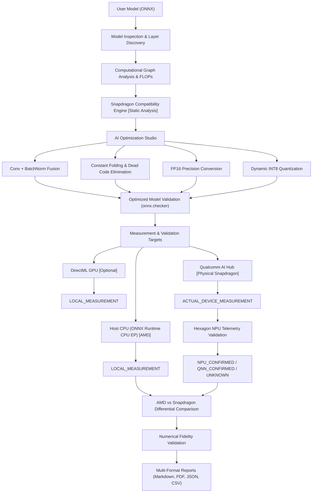

# Nibble — Snapdragon AI Optimization Studio

[](https://www.python.org/)
[](https://microsoft.com/windows)
[](https://amd.com)
[](https://qualcomm.com)
[](https://qt.io)
[](./scripts/test_mvp.py)
[](https://aihub.qualcomm.com/)

**Nibble** is a hardware-aware AI model optimization, validation, and benchmarking platform designed for **Qualcomm Snapdragon-powered PCs**, including Snapdragon X Elite, Snapdragon X Plus, and compatible Snapdragon platforms.

Nibble analyzes computational graphs, evaluates operator compatibility with the Qualcomm Hexagon NPU, Adreno GPU, and CPU, applies optimization techniques such as operator fusion, dead-code elimination, constant folding, and precision conversion, validates numerical fidelity, benchmarks models empirically, and integrates with Qualcomm AI Hub for **physical Snapdragon device profiling and telemetry-backed NPU verification**.

---

## 1. Important Hardware Rule & Development Status

Nibble is actively developed on an **AMD Windows laptop** (`AMD Ryzen 5 8540U w/ Radeon 740M Graphics`, architecture `AMD64`) and uses **Qualcomm AI Hub** for physical Snapdragon validation.

> [!IMPORTANT]
> **Strict Hardware Separation Rule:**
> - AMD hardware is NEVER misrepresented as Qualcomm Snapdragon.
> - Local AMD measurements are reported as `LOCAL_MEASUREMENT`.
> - Physical Snapdragon measurements obtained through Qualcomm AI Hub are reported as `ACTUAL_DEVICE_MEASUREMENT`.
> - NPU execution is only reported as `NPU_CONFIRMED` when supported by device/per-layer telemetry.
> - Benchmark numbers and speedups are NEVER fabricated.
> - Static compatibility analysis is never presented as proof of physical NPU execution.

```text
Development Hardware Status:
  Vendor: AMD
  CPU: AMD Ryzen 5 8540U
  GPU: Radeon 740M
  Architecture: x64/AMD64
  Local Snapdragon NPU: Not present
  Local Qualcomm QNN: Not active

Physical Validation Status:
  Device: Snapdragon X Elite CRD
  OS: Windows 11 ARM64
  Architecture: aarch64-windows
  Hexagon: v73
  Execution: NPU_CONFIRMED
  AI Hub SDK: qai-hub 0.56.0
```

### Measurement Modes

| Measurement Mode | Meaning |
| :--- | :--- |
| `STATIC_ANALYSIS` | Theoretical graph, operator, and Snapdragon compatibility analysis |
| `LOCAL_MEASUREMENT` | Actual measurement performed on the AMD development machine |
| `ACTUAL_DEVICE_MEASUREMENT` | Actual physical Snapdragon measurement returned through Qualcomm AI Hub |

### Execution States

| State | Meaning |
| :--- | :--- |
| `NPU_CONFIRMED` | Telemetry confirms execution on the Hexagon NPU |
| `QNN_CONFIRMED` | Telemetry confirms Qualcomm QNN execution |
| `CPU_EXECUTION` | Execution occurred on CPU |
| `GPU_EXECUTION` | Execution occurred on GPU |
| `UNKNOWN` | Execution target could not be established |

### Supported Capabilities Matrix

| Feature | Supported Now on AMD Development PC | Snapdragon / AI Hub Validation |
| :--- | :--- | :--- |
| **Model Ingestion & Inspection** | Yes (ONNX Opset 11–21) | Yes |
| **Graph Topology & FLOPs Analysis** | Yes (Full graph traversal) | Yes |
| **Snapdragon Compatibility Engine** | Yes (Static Hexagon/Adreno analysis) | Yes (Static + physical validation) |
| **Conv + BatchNorm Operator Fusion** | Yes (Weight folding) | Yes |
| **Graph Optimization** | Yes (Constant folding, dead code) | Yes |
| **FP16 Precision Conversion** | Yes (IEEE float16 weights & ops) | Yes |
| **Dynamic INT8 Quantization** | Yes (CPU dynamic quant via ORT) | Supported optimization path |
| **Snapdragon HTP INT8 (QDQ)** | Static planning | Future native expansion |
| **Inference Execution** | Yes (Host CPU multi-threaded) | Physical NPU profiling completed via AI Hub |
| **GPU Acceleration** | Optional (DirectML if ORT DML installed) | Future/native deployment path |
| **Empirical Benchmarking** | Yes (Real monotonic timer measurements) | Yes (Physical device measurements via AI Hub) |
| **Accuracy Validation** | Yes (Cosine similarity, MAE, RMSE) | Yes |
| **Reporting (MD, PDF, JSON, CSV)** | Yes | Yes |
| **Qualcomm AI Hub Physical Validation** | Yes (Optional official `qai-hub` SDK) | **Completed** |
| **Hexagon NPU Telemetry Verification** | Via AI Hub | **Completed** |
| **AMD vs Snapdragon Comparison** | **Completed** | **Completed** |

---

## 2. Real Snapdragon Validation — Completed

Nibble has successfully completed **physical-device profiling on a Qualcomm Snapdragon X Elite CRD** through the official Qualcomm AI Hub SDK.

This is **not simulated Snapdragon data**. The measurements below are actual physical-device results returned through Qualcomm AI Hub and validated by Nibble's telemetry layer.

### Physical Snapdragon Platform

| Property | Result |
| :--- | :--- |
| **Device** | Snapdragon X Elite CRD |
| **Operating System** | Windows 11 ARM64 |
| **Architecture** | `aarch64-windows` |
| **Chipset** | Qualcomm Snapdragon X Elite |
| **Chipset ID** | `sc8380xp` |
| **Hexagon** | v73 |
| **AI Hub SDK** | `qai-hub 0.56.0` |
| **Execution Target** | Qualcomm Hexagon NPU |
| **Verification** | `NPU_CONFIRMED` |

### FP32 Physical Snapdragon Validation

| Metric | Result |
| :--- | :--- |
| **AI Hub Job ID** | `j57eqe89p` |
| **Execution** | `NPU_CONFIRMED` |
| **NPU Layers** | **11 / 11** |
| **CPU Fallbacks** | **0** |
| **Median Latency** | **0.0460 ms** |
| **Throughput** | **21,739.1 FPS** |
| **Peak Working Set** | **28.21 MB** |

All 11 tested model layers were confirmed on the Hexagon NPU with zero CPU fallback layers for this run.

### FP16 Physical Snapdragon Validation

Nibble generated an FP16 version of the model and validated it on the same physical Snapdragon target.

| Metric | Result |
| :--- | :--- |
| **AI Hub Job ID** | `jgzl1lqx5` |
| **Execution** | `NPU_CONFIRMED` |
| **NPU Layers** | **11 / 11** |
| **CPU Fallbacks** | **0** |
| **Median Latency** | **0.0445 ms** |
| **Throughput** | **22,471.9 FPS** |
| **Peak Working Set** | **28.26 MB** |
| **SHA-256** | `4ed9d72650c53371c01f02be51bca1340cf729902c7cad3857a62a6f36794b69` |

For this specific test model:

```text
FP32 Median Latency = 0.0460 ms
FP16 Median Latency = 0.0445 ms

Measured latency improvement ≈ 3.3%
```

> [!NOTE]
> These results apply to the tested model and configuration. They are not a universal claim that Snapdragon hardware is faster for every AI workload.

### AMD Development Host vs Physical Snapdragon

| Metric | AMD Ryzen 5 8540U | Snapdragon X Elite |
| :--- | :---: | :---: |
| **Execution** | CPU | **Hexagon NPU** |
| **Median Latency** | 0.083 ms | **0.046 ms** |
| **Throughput** | 12,062.7 FPS | **21,739.1 FPS** |
| **Peak Memory** | 147.2 MB | **28.21 MB** |
| **NPU Layers** | — | **11 / 11** |
| **CPU Fallbacks** | — | **0** |

These are measurements for the tested model/configuration. Nibble does not generalize these measurements to all AI workloads.

### NPU Verification

Nibble does not infer NPU execution merely because a device supports Snapdragon or QNN.

The physical validation pipeline is:

```text
Model Upload
     ↓
Qualcomm AI Hub
     ↓
Physical Snapdragon Device
     ↓
Execution Profiling
     ↓
Per-Layer / Device Telemetry
     ↓
Nibble Telemetry Validator
     ↓
NPU_CONFIRMED
```

If telemetry cannot establish the execution target, Nibble reports `UNKNOWN` rather than fabricating an NPU result.

---

## 3. Complete End-to-End Pipeline



---

## 4. Installation & Virtual Environment Setup

### Prerequisites

* Windows 11 (AMD, Intel, or Qualcomm ARM64 PC)
* Python 3.11+
* Git

### Step-by-Step Setup

```powershell
# 1. Clone the repository
git clone https://github.com/vatsalpro/nibble.git
cd nibble

# 2. Create and activate a clean virtual environment
py -3.11 -m venv .venv
.venv\Scripts\activate

# 3. Upgrade pip
python -m pip install --upgrade pip

# 4. Install lean runtime dependencies
pip install -r requirements.txt
```

### Dependency Files Structure

* **`requirements.txt`**: Lean core runtime (`numpy`, `onnx`, `onnxruntime`, `psutil`, `pydantic`, `PySide6`, `matplotlib`, `pandas`, `SQLAlchemy`, `reportlab`, `rich`, `click`, `requests`).
* **`requirements-dev.txt`**: Development and test suite tools (`pytest`, `black`, `flake8`).
* **`requirements-snapdragon.txt`**: Snapdragon/Qualcomm-specific packages (`onnxruntime-qnn`, `qai-hub`).

---

## 5. Test Model Generator

Generate a reproducible, verified ONNX test CNN containing standard layers:

```text
Conv -> Relu -> Conv -> Relu -> GlobalAveragePool -> Flatten -> Gemm
```

Run:

```powershell
python scripts/create_test_model.py
```

Example output:

```text
[OK] Generated and verified test model: models/test_cnn.onnx
```

---

## 6. Automated 15-Stage MVP Validation

Run the single automated end-to-end verification script:

```powershell
python scripts/test_mvp.py
```

This verifies the complete 15-step pipeline without mock data:

1. Python Environment Check
2. Hardware Detection Check
3. Test Model Generation
4. Model Structural Validation
5. Model Architecture Inspection
6. Computational Graph Analysis
7. Snapdragon Compatibility Analysis `[STATIC_ANALYSIS]`
8. Model Optimization
9. Output Model Validation
10. Original Model CPU Inference
11. Optimized Model CPU Inference
12. Empirical Benchmarking
13. Accuracy Validation
14. Qualcomm Backend Refusal & Isolation Test
15. Report Generation

Expected Final Output:

```text
============================================================
    NIBBLE MVP VALIDATION: PASSED
============================================================
```

---

## 7. Command-Line Interface (CLI)

Nibble provides a unified CLI module executable directly with `python -m nibble`.

### 1. Hardware Inspection

```powershell
python -m nibble hardware
```

### 2. Model Analysis

```powershell
python -m nibble analyze models/test_cnn.onnx
```

### 3. Model Optimization

```powershell
python -m nibble optimize models/test_cnn.onnx --precision FP16
```

### 4. Empirical Benchmarking

```powershell
python -m nibble benchmark models/test_cnn.onnx --warmup 10 --runs 50
```

### 5. Automated MVP Validation

```powershell
python -m nibble test-mvp
```

### 6. Qualcomm AI Hub Validation & Device Profiling

Check AI Hub readiness:

```powershell
python -m nibble aihub status
```

Configure AI Hub:

```powershell
python -m nibble aihub configure --token YOUR_API_TOKEN
```

List available physical Snapdragon devices:

```powershell
python -m nibble aihub devices --filter "X Elite"
```

Profile on a physical Snapdragon target:

```powershell
python -m nibble aihub profile models/test_cnn.onnx --device "Snapdragon X Elite CRD"
```

Compare AMD host execution with Snapdragon:

```powershell
python -m nibble compare-local-aihub models/test_cnn.onnx
```

### 7. Desktop GUI

Launch the modern PySide6 desktop interface:

```powershell
python -m nibble gui
# or:
python run.py
```

---

## 8. Qualcomm AI Hub Integration Architecture

Nibble integrates with the official Qualcomm AI Hub Python SDK (`qai-hub`) as an independent, optional validation backend.

### Offline-First Independence

If AI Hub is unconfigured or unavailable, Nibble continues operating locally on the AMD development machine.

### Zero Fabrication

Host AMD CPU/GPU metrics are never reported as Snapdragon NPU metrics.

Remote Snapdragon profiling is explicitly classified as:

```text
ACTUAL_DEVICE_MEASUREMENT
```

and verified using returned telemetry.

### Reproducible Telemetry

Completed jobs export audit bundles under:

```text
reports/aihub/<job_id>/
```

Typical artifacts:

```text
raw_result.json
normalized_result.json
summary.md
```

### Demonstrated Jobs

Baseline FP32:

```text
Job ID: j57eqe89p
Execution: NPU_CONFIRMED
```

Optimized FP16:

```text
Job ID: jgzl1lqx5
Execution: NPU_CONFIRMED
```

For in-depth documentation, see [docs/qualcomm_aihub.md](docs/qualcomm_aihub.md).

---

## 9. Future Native Deployment on HP Snapdragon PCs

Nibble has already demonstrated **physical Snapdragon NPU profiling through Qualcomm AI Hub**.

Direct native deployment and execution on an end-user HP Snapdragon PC remains future work.

The intended native path is:

```text
Optimized ONNX Model
        ↓
HP Snapdragon PC
        ↓
Qualcomm Runtime / QNN
        ↓
Hexagon HTP
        ↓
Native Device Benchmark
        ↓
Telemetry
        ↓
Nibble Report
```

### Future Snapdragon Setup

Install Snapdragon-specific dependencies:

```powershell
pip install -r requirements-snapdragon.txt
```

Configure the Qualcomm QNN SDK:

```powershell
$env:QNN_SDK_ROOT = "C:\Qualcomm\QNN"
```

Example future HTP configuration:

```python
flags = {
    "backend_path": "QnnHtp.dll",
    "htp_performance_mode": "burst",
    "htp_graph_finalization_optimization_mode": "3",
    "vtcm_size_in_mb": "8",
    "precision": "INT8"
}
```

> [!WARNING]
> The native Snapdragon deployment path above is a future expansion. Nibble does not claim native end-user Snapdragon execution as completed merely because physical Snapdragon profiling has been completed through Qualcomm AI Hub.

---

## 10. Reproducibility & Measurement Integrity

Nibble is designed around reproducible measurements rather than simulated demonstrations.

### Measurement Provenance

Every result belongs to one of the following categories:

```text
STATIC_ANALYSIS
LOCAL_MEASUREMENT
ACTUAL_DEVICE_MEASUREMENT
```

### No Synthetic Hardware Metrics

Nibble never invents:

* NPU latency
* NPU throughput
* NPU utilization
* NPU memory
* QNN execution
* CPU fallback counts
* Snapdragon speedups
* Physical-device benchmark results

### Accuracy Before Performance

An optimization is not considered successful solely because it is faster.

Nibble validates numerical fidelity using:

* MAE
* RMSE
* Cosine Similarity

### Reproducible AI Hub Artifacts

```text
reports/
└── aihub/
    └── <job_id>/
        ├── raw_result.json
        ├── normalized_result.json
        └── summary.md
```

---

## 11. Desktop GUI

Launch:

```powershell
python -m nibble gui
```

or:

```powershell
python run.py
```

The GUI provides access to:

* Model upload
* Model inspection
* Snapdragon compatibility analysis
* Model optimization
* FP16 conversion
* Benchmarking
* Accuracy validation
* Qualcomm AI Hub
* Physical Snapdragon profiling
* AMD vs Snapdragon comparison
* Reports
* Settings

---

## 12. Project Status

### Completed

- [x] ONNX model ingestion
- [x] Model architecture inspection
- [x] Computational graph analysis
- [x] FLOPs and parameter analysis
- [x] Snapdragon compatibility analysis
- [x] Constant folding
- [x] Dead-code elimination
- [x] Operator fusion
- [x] FP16 optimization
- [x] Accuracy validation
- [x] AMD local benchmarking
- [x] Qualcomm AI Hub integration
- [x] Physical Snapdragon X Elite profiling
- [x] Hexagon NPU telemetry verification
- [x] `NPU_CONFIRMED` execution reporting
- [x] AMD vs Snapdragon comparison
- [x] Reproducible AI Hub artifacts
- [x] Desktop GUI
- [x] CLI
- [x] Automated MVP validation

### Future Work

- [ ] Native HP Snapdragon PC deployment
- [ ] Expanded Snapdragon device coverage
- [ ] INT8/QDQ HTP optimization and validation
- [ ] Per-layer performance visualization
- [ ] Multi-device benchmarking
- [ ] Automated deployment workflows
- [ ] Expanded ONNX operator coverage
- [ ] Larger model validation suite

---

## 13. Why Nibble?

A model being compatible with a hardware platform does not automatically prove that it is optimized for or actually executing on the desired accelerator.

Nibble addresses this gap by connecting:

```text
Compatibility Analysis
        +
Model Optimization
        +
Accuracy Validation
        +
Local Benchmarking
        +
Physical Snapdragon Profiling
        +
NPU Telemetry
        +
Performance Comparison
        +
Reproducible Reports
```

The result is a **measurement-driven AI optimization and validation workflow for Snapdragon PCs**.

---

## 14. License

Internal Development & Evaluation License. All rights reserved.
